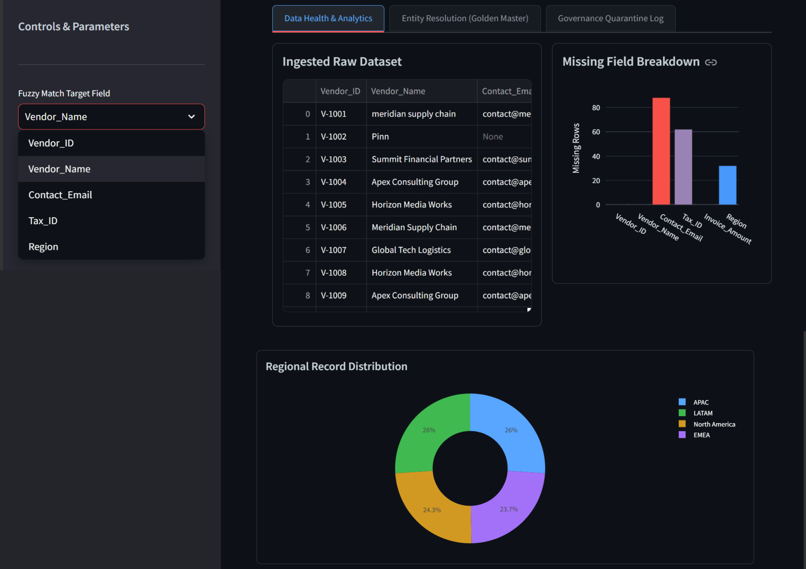
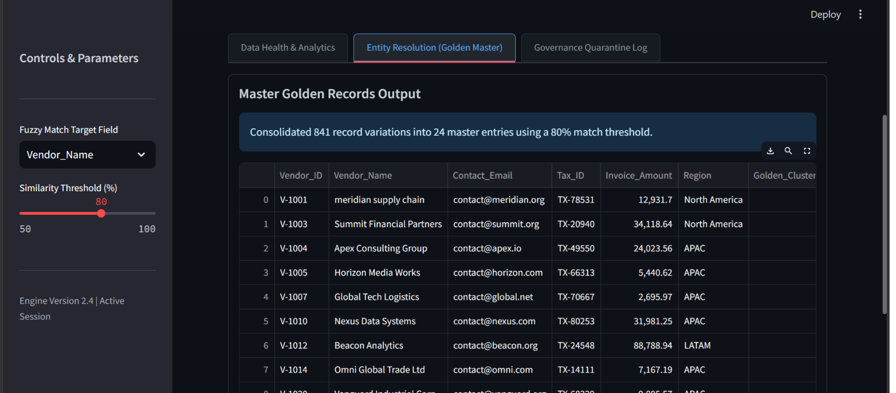
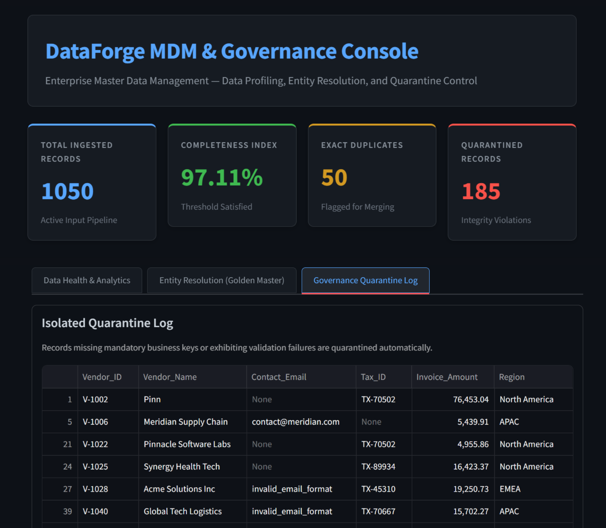

# DataForge MDM & Governance Platform

An Enterprise Master Data Management (MDM) platform engineered with Streamlit, Pandas, and Fuzzy Matching algorithms. DataForge provides automated real-time data profiling, fuzzy entity resolution, and governance quarantine isolation for enterprise vendor records.

---

## Platform Interface Preview

<div align="center">

### 1. Data Health & Analytics Overview


---

### 2. Entity Resolution & Golden Master Generation


---

### 3. Governance Quarantine & Audit Log


</div>

---

## Key Capabilities

- **Automated Data Profiling:** Computes real-time data completeness scores, missing attribute distributions, and regional vendor breakdowns.
- **Entity Resolution Engine:** Leverages token-sort fuzzy matching algorithms to group dirty vendor variations and consolidate them into unified **Golden Master Records**.
- **Governance Quarantine Protocol:** Automatically identifies non-compliant records (missing business keys, malformed contact emails, invalid tax IDs) and isolates them in an audit table for remediation.
- **Export-Ready Output:** Automatically writes processed master records and quarantined entries to downstream CSV pipelines for BI analysis.

---

## Tech Stack & Architecture

- **Frontend / Dashboard Framework:** Streamlit
- **Data Manipulation:** Pandas, NumPy
- **Interactive Visualizations:** Plotly Express
- **Entity Resolution / Fuzzy Logic:** TheFuzz (Levenshtein Distance)
- **Programming Language:** Python 3.10+

---

## Quick Start & Local Execution

Run these commands in your terminal to set up and launch the platform:

```bash
git clone [https://github.com/Ipseity01/dataforge-mdm-platform.git](https://github.com/Ipseity01/dataforge-mdm-platform.git)
cd dataforge-mdm-platform
pip install -r requirements.txt
python generate_data.py
streamlit run app.py
